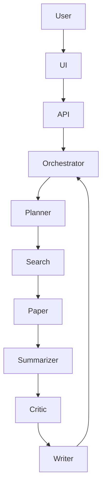

# 🚀 Autonomous AI Research Agent

[](https://hub.docker.com/u/mrshibly)
[](https://fastapi.tiangolo.com/)
[](https://reactjs.org/)
[](https://opensource.org/licenses/MIT)

An **Autonomous Multi-Agent AI System** that researches a topic, analyzes academic papers and web data, and produces **structured, citation-aware research reports automatically**.

Unlike simple LLM wrappers, this system uses a **multi-agent orchestration pipeline with verification loops and hybrid RAG retrieval** to improve factual accuracy and research depth.

------------------------------------------------------------------------

# 🌟 Overview

The **Autonomous AI Research Agent** automates the entire research workflow:

1️⃣ Generates research queries  
2️⃣ Searches academic databases and the web  
3️⃣ Downloads and parses research papers  
4️⃣ Extracts key information and findings  
5️⃣ Verifies outputs with a critic agent  
6️⃣ Produces a structured final research report

The result is a **high-fidelity research synthesis pipeline** capable of handling complex technical topics.

------------------------------------------------------------------------

# 🎯 Key Features

## 🤖 Multi-Agent Architecture

A coordinated system of specialized AI agents:

-   **Planner Agent** — generates research queries
-   **Search Agent** — retrieves web and academic sources
-   **Paper Agent** — parses PDFs and extracts text
-   **Summarizer Agent** — extracts technical insights
-   **Critic Agent** — verifies factual accuracy
-   **Writer Agent** — synthesizes the final report

------------------------------------------------------------------------

## 🔍 Hybrid RAG Retrieval

**Dense Retrieval**
- Sentence-Transformers embeddings
- FAISS vector database
- Semantic similarity search

**Sparse Retrieval**
- BM25 keyword ranking

Results are **reranked and fused** to improve context quality.

------------------------------------------------------------------------

## ⚖️ Critic Verification Loop

Writer → Critic → Revision → Writer

Ensures technical accuracy and reduces hallucinations.

------------------------------------------------------------------------

# 🏗️ System Architecture



------------------------------------------------------------------------

# 🛠 Tech Stack

**Frontend**
- React
- Vite

**Backend**
- FastAPI
- Async SQLAlchemy

**AI / ML**
- Groq / OpenAI / Ollama
- Sentence Transformers
- FAISS
- BM25
- PyMuPDF

**DevOps**
- Docker
- Docker Compose

------------------------------------------------------------------------

# 🐳 Quick Start

```bash
docker-compose up -d
```

Frontend: http://localhost:8002  
API Docs: http://localhost:8001/docs

------------------------------------------------------------------------

# 👤 Author

**Shibly**

**GitHub**  
[https://github.com/mrshibly](https://github.com/mrshibly)

**HuggingFace Space**  
[https://huggingface.co/spaces/mrshibly/autonomous-research-agent](https://huggingface.co/spaces/mrshibly/autonomous-research-agent)
