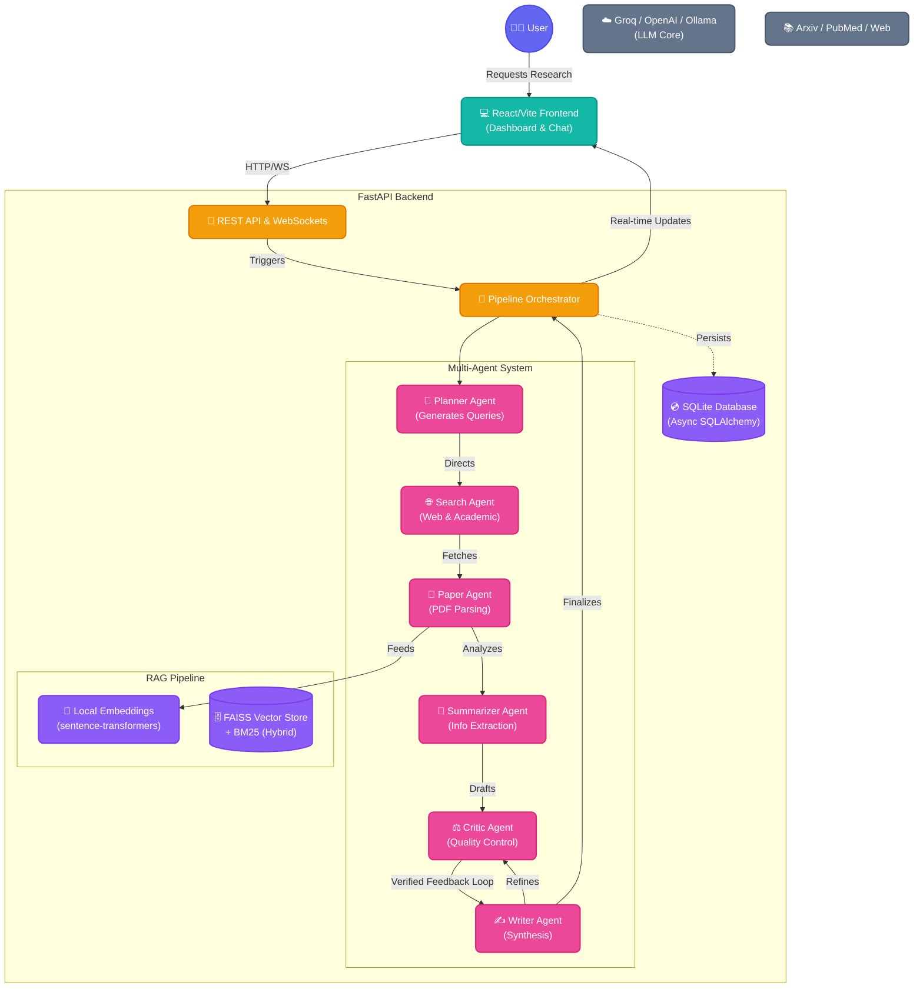

# 🚀 Autonomous AI Research Agent

[](https://hub.docker.com/u/mrshibly)
[](https://fastapi.tiangolo.com/)
[](https://reactjs.org/)
[](https://opensource.org/licenses/MIT)

An intelligent, multi-agent autonomous system designed to combat information overload by synthesizing academic papers and web data into structured, actionable research reports.

---

## 🌟 Overview

The **Autonomous AI Research Agent** is a sophisticated 6-stage pipeline that automates the entire research process—from query generation and paper discovery to deep PDF analysis and final synthesis. Unlike standard LLM wrappers, this system employs a **Multi-Agent Orchestrator** with a built-in **Critic Loop** to ensure high-fidelity, hallucination-free output.

### 🎥 Visual Tour

```carousel

<!-- slide -->

<!-- slide -->

```

---

## 🏗️ Technical Architecture

The platform is built on a distributed micro-agent architecture where specialized AI agents collaborate through a centralized orchestrator.



---

## 🔥 Key Technical Highlights

### 1. Unified Hybrid RAG

Utilizes a dual-indexing strategy:

- **Dense Retrieval**: `all-MiniLM-L6-v2` embeddings stored in a FAISS vector store for semantic similarity.
- **Sparse Retrieval**: `BM25` keyword indexing for precise term matching.
- **Result Reranking**: Intelligently combines and ranks results for superior context retrieval during the "Chat with Report" phase.

### 2. Multi-Agent Critic Loop

Features an iterative refinement process where the **Critic Agent** evaluates the **Writer's** output against source documents. If technical accuracy falls below thresholds, the report is autonomously sent back for correction.

### 3. Production-Grade Resilience

- **Smart Retries**: Built-in exponential backoff with jitter for handling LLM rate limits.
- **Real-Time Visibility**: Full-duplex WebSocket communication provides users with live stage updates and agent reasoning logs.
- **Optimized Containers**: Backend image reduced from **4.4GB to 599MB** using multi-stage builds and CPU-optimized machine learning libraries.

---

## 🐳 Getting Started (3-Minute Setup)

### 1. Deploy with Docker (Recommended)

The fastest way to get up and running is via Docker Compose:

```bash
docker-compose up -d
```

- **Web UI**: [http://localhost:8002](http://localhost:8002)
- **API Docs**: [http://localhost:8001/docs](http://localhost:8001/docs)

### 2. Manual Image Pull (Docker Hub)

You can also pull the official pre-built images directly:
*   **Backend**: `docker pull mrshibly/autonomous-research-agent-backend:latest`
*   **Frontend**: `docker pull mrshibly/autonomous-research-agent-frontend:latest`

### 3. Standard Local Setup


If you prefer running natively:

**Backend**:

```bash
cd backend
python -m venv venv
# Activate & Install
pip install -r requirements.txt
cp .env.example .env # Add your GROQ_API_KEY
uvicorn app.main:app --port 8001
```

**Frontend**:

```bash
cd frontend
npm install
npm run dev -- --port 8002
```

---

## 🛠️ Tech Stack

- **Foundations**: React 18, Vite, FastAPI (Python 3.11+)
- **AI/Agents**: Groq, OpenAI API, Ollama, LangGraph-inspired Orchestration
- **RAG/ML**: FAISS, Sentence-Transformers, BM25, PyMuPDF
- **DevOps**: Docker, Multi-stage Builds, GitHub Actions Ready

---

## 📄 License

Distributed under the MIT License. See `LICENSE` for more information.
