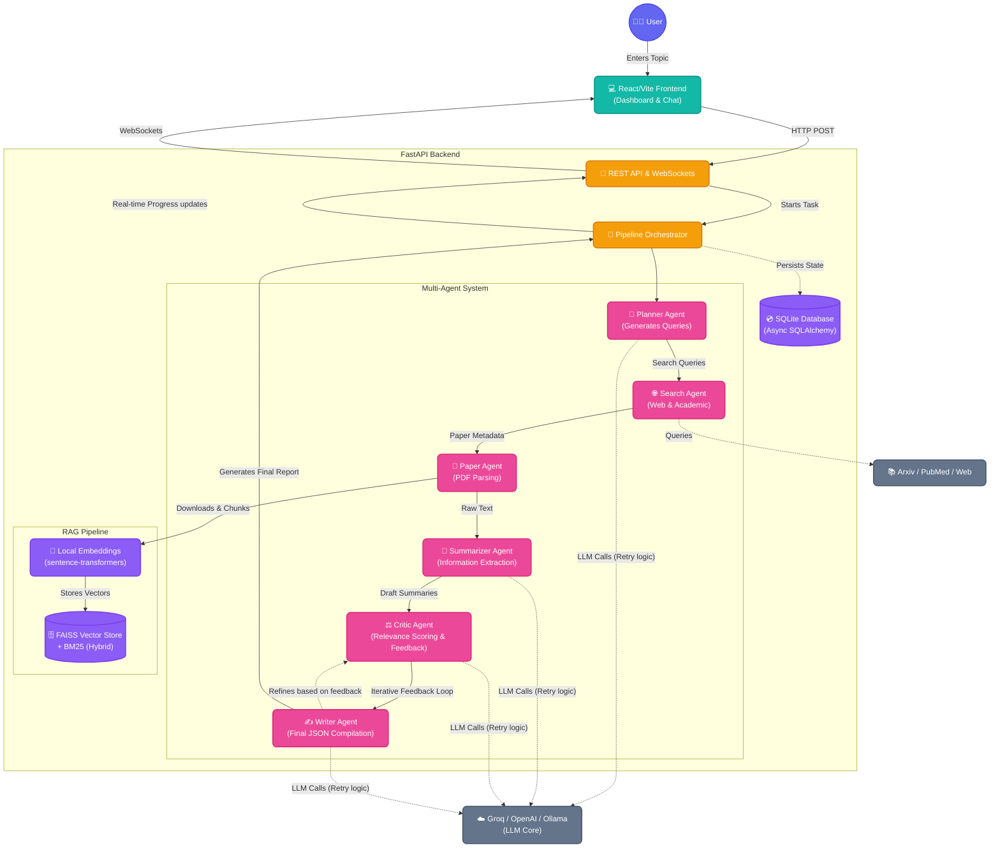

# 🚀 Autonomous AI Research Agent

Welcome to my **Autonomous AI Research Agent**! 

I built this project to solve a problem I face every day: *information overload*. We are constantly bombarded with new academic papers, articles, and research. Finding the signal in the noise takes hours. I wanted to build an intelligent, multi-agent system that could do the heavy lifting for me—autonomously searching the web, reading complex PDFs, synthesizing the data, and presenting it in a clean, professional report.

This isn't just a basic wrapper around an API; it's a **6-stage autonomous pipeline** featuring hybrid RAG, self-correction loops, and real-time WebSocket communication, all wrapped in a premium, responsive UI.

---

## 🏗️ The Architecture (How it Works)

At the core of this platform is a multi-agent orchestrator. I designed it to mimic a real human research team: a planner to define the scope, researchers to gather data, a critic to ensure quality, and a lead writer to compile the final report.

Here is a detailed look at the system architecture:



---

## ✨ Key Technical Highlights

If you're an engineer or hiring manager looking at this code, here are the parts I'm most proud of:

### 1. The Multi-Agent Orchestrator
Instead of a single mega-prompt, the system breaks the problem down. The **Critic Agent** genuinely evaluates the **Summarizer Agent's** output against the raw text. If the relevance is low (e.g., `< 30%`), it drops the paper entirely so your final report isn't polluted with noise.

### 2. Hybrid RAG Implementation
I didn't stop at basic vector search. I implemented a **Hybrid RAG** system that combines dense vector search (using local `sentence-transformers` via **FAISS**) with sparse keyword search (**BM25**). This means we capture both semantic meaning and exact keyword matches when chatting with the documents.

### 3. Graceful Degradation & Resilience
LLM APIs fail. They hit rate limits constantly. I built an exponential backoff with jitter directly into the `llm_client.py`. If Groq yells `429 Too Many Requests`, the backend gracefully waits and retries, rather than tanking the entire 10-minute research run.

### 4. Real-Time WebSockets
Users hate waiting. The FastAPI backend streams progress updates (like "Evaluating paper 3 of 5") directly to the React frontend via WebSockets, so the fluid, glassmorphic UI is always alive and responsive.

---

## 🛠️ Quick Start Guide

Want to run it yourself? It's designed to be completely free to run locally (defaults to Groq and local embeddings).

### 1. Spin up the Backend (FastAPI)

```bash
cd backend
python -m venv venv

# Activate (Windows)
venv\Scripts\activate
# Activate (Mac/Linux)
# source venv/bin/activate

pip install -r requirements.txt
cp .env.example .env

# Edit .env and add your free GROQ_API_KEY
```

Start the server:
```bash
uvicorn app.main:app --host 0.0.0.0 --port 8001
```

### 2. Spin up the Frontend (React + Vite)

```bash
cd frontend
npm install
npm run dev
```

Visit **`http://localhost:8002`** and start researching!

---

## 💻 Tech Stack
- **Frontend:** React, Vite, CSS (Glassmorphism), React-Markdown
- **Backend:** FastAPI, Python, Asyncio, WebSockets
- **AI/ML:** Langchain concepts, FAISS, `sentence-transformers`, `rank_bm25`, PyMuPDF
- **Data:** SQLite, SQLAlchemy (Async)
- **Providers:** Groq (primary), OpenAI, Ollama

Thank you for checking out my project! I built every part of this—from the CSS media queries to the asynchronous LLM retry logic—because I genuinely love building intelligent systems.
